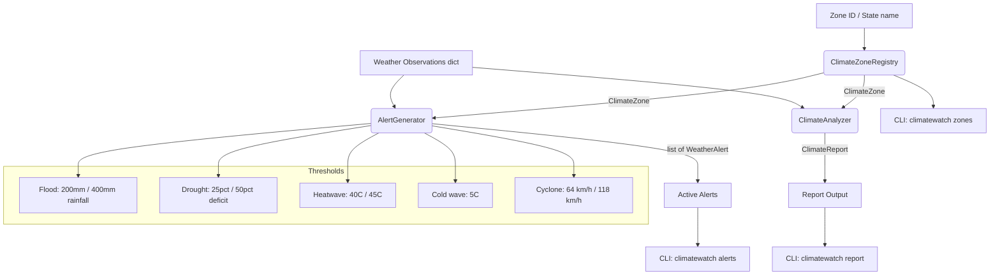

# aumai-climatewatch

> Climate monitoring and early warning system for India — IMD-aligned zone classification, flood/drought/heatwave/cyclone alerts, and climate reporting. Part of the [AumAI](https://github.com/aumai) open-source agentic infrastructure suite.

[](https://pypi.org/project/aumai-climatewatch/)
[](https://www.python.org/downloads/)
[](LICENSE)
[](https://github.com/aumai/aumai-climatewatch/actions)

---

> **ENVIRONMENTAL DISCLAIMER**
> Climate and weather data provided by this tool are estimates based on historical averages and
> modelled projections. Do not use this tool as the sole basis for emergency response decisions.
> Always verify alerts with official meteorological authorities such as IMD (India Meteorological
> Department) before taking action. For life-safety decisions, always follow instructions from
> the National Disaster Management Authority (NDMA) and state disaster management agencies.

---

## What is ClimateWatch?

Every year, floods displace millions of people across Bihar and Assam. Droughts devastate crops
across Vidarbha and Bundelkhand. Heatwaves kill hundreds in Rajasthan and UP. Cyclones make
landfall on the Odisha and Andhra coasts with increasing frequency.

The India Meteorological Department (IMD) issues forecasts, but those forecasts need to be
integrated into applications — farm advisory platforms, disaster management dashboards,
municipal alert systems, insurance underwriting tools — before they reach the people who need
them.

ClimateWatch is the Python library that makes IMD-aligned climate data programmatically
accessible. It provides:

- **Six climate zone definitions** covering all of India, aligned with IMD's meteorological
  subdivision framework.
- **A rule-based alert engine** that applies validated meteorological thresholds to generate
  flood, drought, heatwave, cold wave, and cyclone alerts.
- **A climate report generator** that combines current conditions with alert evaluation and a
  short-range forecast summary.
- **Trend analysis** that computes temperature and rainfall anomalies from historical
  observation series.

ClimateWatch is not a weather model. It does not download live IMD data. It is the programmable
layer that sits between your data feed and your application logic.

## Why Does This Matter?

India faces compounding climate risks across a vast, diverse geography. Effective early warning
requires:

1. **Standardised zone taxonomy.** Applications must speak the same language about which region
   they are discussing. ClimateWatch's six zones with explicit state membership provide that.
2. **Threshold-based alert generation.** Meteorologists use defined thresholds (e.g., 204.5 mm/day
   = "extremely heavy" rainfall). ClimateWatch encodes those thresholds into reusable Python
   logic triggerable from any data source.
3. **Composable, typed outputs.** Every alert and report is a Pydantic v2 model — ready to be
   serialised to JSON, stored in a database, pushed to a message queue, or fed into a downstream
   agentic AI system.
4. **Integration with agricultural platforms.** Climate alerts must reach farmers, not just
   meteorologists. ClimateWatch is designed to integrate with aumai-farmbrain and
   aumai-kisanmitra to embed climate risk into crop advisories and farmer queries.

## Architecture



**The three core classes:**

- `ClimateZoneRegistry` — lookup table for India's six IMD climate zones.
- `AlertGenerator` — applies threshold rules to a weather observation dictionary and returns
  typed `WeatherAlert` objects.
- `ClimateAnalyzer` — orchestrates alert generation plus forecast summarisation into a full
  `ClimateReport`, and provides trend analysis over historical observation series.

## Features

- **Six India climate zones** (Northwest, Northeast, Central, Western, Southern Peninsula,
  Eastern) with state membership, average rainfall, and average temperature
- **Five alert types:** flood, drought, heatwave, cold wave, cyclone
- **Two severity levels per type:** watch, warning, and severe_warning for extreme events
- **IMD-aligned alert thresholds:**
  - Flood watch: 200 mm/24h; Severe flood warning: 400 mm/24h
  - Drought watch: 25% below normal; Severe drought warning: 50% below normal
  - Heatwave warning: 40°C; Severe heatwave warning: 45°C
  - Cold wave warning: at or below 5°C
  - Cyclone watch: 64 km/h; Severe cyclone warning: 118 km/h
- **Unique alert IDs** (UUID4) for deduplication and correlation
- **Alert validity windows** — 24h for acute events, 7 days for drought
- **Climate reports** with current conditions, active alerts, and 24h/7-day forecast summaries
- **Trend analysis** with temperature and rainfall anomaly computation vs. zone normals
- **CLI** with `alerts`, `report`, and `zones` subcommands
- **Pydantic v2 models** — full validation, UTC-aware datetimes
- **Apache 2.0 licensed**

## Quick Start

### Install

```bash
pip install aumai-climatewatch
```

Or with `uv`:

```bash
uv add aumai-climatewatch
```

### Python API — generate alerts for a zone

```python
from aumai_climatewatch.core import ClimateZoneRegistry, AlertGenerator

registry = ClimateZoneRegistry()
zone = registry.get_zone("eastern-india")

# Weather observations for Bihar during monsoon peak
observations = {
    "temperature_c": 34.0,
    "rainfall_mm": 280.0,   # exceeds 200 mm flood watch threshold
    "humidity_pct": 90.0,
    "wind_kmh": 30.0,
    "rainfall_deficit_pct": 0.0,
}

generator = AlertGenerator()
alerts = generator.evaluate_conditions(zone, observations)

for alert in alerts:
    print(f"[{alert.severity.upper()}] {alert.alert_type}: {alert.message}")
```

### CLI — check current alerts for a zone

```bash
climatewatch alerts --zone eastern-india

# With custom weather data
climatewatch alerts --zone central-india --data observations.json
```

### CLI — generate a full climate report

```bash
climatewatch report --zone western-india
```

### CLI — list all zones

```bash
climatewatch zones
```

## CLI Reference

### `climatewatch alerts`

Generate weather alerts for a climate zone. Without `--data`, uses synthetic data based on
zone normal conditions for demonstration.

```
Usage: climatewatch alerts [OPTIONS]

Options:
  --zone TEXT        Zone ID (e.g. central-india, western-india)  [required]
  --data PATH        JSON file with current weather observations
  --help             Show this message and exit.
```

**Available zone IDs:**
`northwest-india`, `northeast-india`, `central-india`, `western-india`,
`southern-peninsula`, `eastern-india`

**Observation JSON schema:**

```json
{
  "temperature_c": 38.0,
  "rainfall_mm": 250.0,
  "humidity_pct": 85.0,
  "wind_kmh": 45.0,
  "rainfall_deficit_pct": 0.0
}
```

**Example output:**

```
WEATHER ALERTS: Eastern India
States: West Bengal, Bihar, Uttar Pradesh, Uttarakhand
============================================================

ALERT TYPE: FLOOD
SEVERITY:   WARNING
MESSAGE:    FLOOD WARNING for Eastern India. Heavy rainfall of 280 mm
            expected in 24 hours. Move to higher ground if in low-lying areas.
VALID UNTIL: 2026-02-28 14:22 UTC
```

---

### `climatewatch report`

Generate a comprehensive climate report including current conditions, active alerts, and a
short-range forecast summary.

```
Usage: climatewatch report [OPTIONS]

Options:
  --zone TEXT        Zone ID  [required]
  --data PATH        Optional JSON file with weather observations
  --help             Show this message and exit.
```

---

### `climatewatch zones`

List all available climate zones with zone ID, name, average annual rainfall, and average
annual temperature.

```
Usage: climatewatch zones [OPTIONS]

Options:
  --help    Show this message and exit.
```

**Example output:**

```
INDIA CLIMATE ZONES:
Zone ID                Name                   Avg Rain (mm)  Avg Temp (C)
---------------------------------------------------------------------------
northwest-india        Northwest India                   350          24.0
northeast-india        Northeast India                  2500          22.0
central-india          Central India                    1100          27.0
western-india          Western India                     900          27.5
southern-peninsula     Southern Peninsula               1200          28.0
eastern-india          Eastern India                    1050          26.5
```

---

### `climatewatch serve`

Start the ClimateWatch API server (not yet implemented in v0.1.0).

---

## Python API Examples

### List all zones and find a zone by state

```python
from aumai_climatewatch.core import ClimateZoneRegistry

registry = ClimateZoneRegistry()

for zone in registry.all_zones():
    print(f"{zone.zone_id}: {zone.name} — {len(zone.states)} states")

zones = registry.zones_for_state("Maharashtra")
print(f"Maharashtra is in: {zones[0].name}")
```

### Generate alerts with multiple simultaneous event types

```python
from aumai_climatewatch.core import ClimateZoneRegistry, AlertGenerator

registry = ClimateZoneRegistry()
generator = AlertGenerator()

# Northwest India during a summer heatwave with drought
zone = registry.get_zone("northwest-india")
observations = {
    "temperature_c": 47.0,          # severe heatwave: > 45°C
    "rainfall_mm": 2.0,
    "humidity_pct": 20.0,
    "wind_kmh": 30.0,
    "rainfall_deficit_pct": 55.0,   # severe drought: > 50%
}

alerts = generator.evaluate_conditions(zone, observations)
print(f"{len(alerts)} alerts generated:")
for alert in alerts:
    print(f"  [{alert.severity}] {alert.alert_type}")
    print(f"  Alert ID: {alert.alert_id}")
    print(f"  Valid until: {alert.valid_until}")
```

### Generate a full climate report

```python
from aumai_climatewatch.core import ClimateZoneRegistry, ClimateAnalyzer

registry = ClimateZoneRegistry()
analyzer = ClimateAnalyzer()

zone = registry.get_zone("southern-peninsula")
observations = {
    "temperature_c": 29.5,
    "rainfall_mm": 60.0,
    "humidity_pct": 75.0,
    "wind_kmh": 18.0,
    "rainfall_deficit_pct": 5.0,
}

report = analyzer.generate_report(zone, observations)

print(f"Zone: {report.zone.name}")
print(f"Active alerts: {len(report.alerts)}")
print(f"7-day trend: {report.forecast['next_7_days']}")

import json
print(json.dumps(report.model_dump(), indent=2, default=str))
```

### Trend analysis over historical observations

```python
from aumai_climatewatch.core import ClimateZoneRegistry, ClimateAnalyzer

registry = ClimateZoneRegistry()
analyzer = ClimateAnalyzer()
zone = registry.get_zone("central-india")

# Simulate 30 days of observations
historical = [
    {"temperature_c": 30.0 + (i % 5), "rainfall_mm": 15.0 + (i % 10)}
    for i in range(30)
]

trend = analyzer.trend_analysis(zone, historical)
print(f"Temperature anomaly: {trend['temperature']['anomaly_vs_normal_c']}°C vs normal")
print(f"Total rainfall: {trend['rainfall']['total_mm']} mm")
print(f"Rainfall deficit: {trend['rainfall']['deficit_vs_normal_pct']}%")
```

## Configuration

ClimateWatch has no required external configuration. The `ClimateZoneRegistry` is initialised
from a static in-process dataset.

Alert thresholds are module-level constants in `core.py`:

| Constant                    | Value    | Meaning                                |
|-----------------------------|----------|----------------------------------------|
| `_FLOOD_RAINFALL_MM`        | 200.0    | 24h rainfall triggering flood warning  |
| `_FLOOD_SEVERE_RAINFALL_MM` | 400.0    | 24h rainfall triggering severe warning |
| `_DROUGHT_DEFICIT_PCT`      | 25.0     | % below normal for drought watch       |
| `_DROUGHT_SEVERE_PCT`       | 50.0     | % below normal for severe drought      |
| `_HEATWAVE_TEMP_C`          | 40.0     | Heatwave warning threshold             |
| `_SEVERE_HEATWAVE_TEMP_C`   | 45.0     | Severe heatwave threshold              |
| `_COLD_WAVE_TEMP_C`         | 5.0      | Cold wave threshold                    |
| `_CYCLONE_WIND_KMH`         | 64.0     | Cyclone watch (Beaufort 8)             |
| `_SEVERE_CYCLONE_WIND_KMH`  | 118.0    | Severe cyclonic storm threshold        |

To override thresholds for a custom deployment, subclass `AlertGenerator` or patch the
constants before instantiation.

## How It Works — Deep Dive

### ClimateZoneRegistry

Six `ClimateZone` Pydantic models are constructed from a static `_ZONES` list at import time.
Zones are stored in a dict keyed by `zone_id`. `zones_for_state()` does a case-insensitive
linear scan across all zones — O(states_total), negligible for six zones.

### AlertGenerator

`evaluate_conditions()` accepts a `ClimateZone` and a plain `dict[str, object]` of weather
observations. This loose input type allows integration with any JSON weather data source
without requiring a strict schema at the point of ingestion.

Four sets of if/elif rules map each observation key to the relevant alert type. Each alert is a
fresh `WeatherAlert` with a UUID4 `alert_id`, UTC-aware `issued_at`, and `valid_until` of
now + 24h for acute events or now + 7 days for drought. Multiple simultaneous alert types are
fully supported — a single observation set can generate flood + heatwave alerts together.

### ClimateAnalyzer

`generate_report()` calls `AlertGenerator.evaluate_conditions()` then builds a two-level
forecast summary:

- `next_24h`: repeats current observations with 80% dampening on rainfall (a simple persistence
  forecast heuristic).
- `next_7_days`: classifies the temperature and rainfall trend as wetter/drier/near normal
  based on comparison with zone averages.

`trend_analysis()` aggregates a list of historical observation dicts, computing mean, min, max,
and anomaly relative to zone normal for both temperature and rainfall.

## Integration with Other AumAI Projects

| Project              | Integration point |
|----------------------|-------------------|
| **aumai-farmbrain**  | `ClimateReport.current_conditions` maps directly to `WeatherData` for crop advisory risk alerts. |
| **aumai-kisanmitra** | `WeatherAlert.message` text can be surfaced in `FarmerResponse.answer` when weather keywords are detected. |

Example bridge — translating a ClimateWatch observation into FarmBrain weather input:

```python
from aumai_climatewatch.core import ClimateZoneRegistry, ClimateAnalyzer
from aumai_farmbrain.models import WeatherData

registry = ClimateZoneRegistry()
analyzer = ClimateAnalyzer()
zone = registry.get_zone("eastern-india")

obs = {
    "temperature_c": 41.0,
    "rainfall_mm": 5.0,
    "humidity_pct": 30.0,
    "wind_kmh": 20.0,
    "rainfall_deficit_pct": 35.0,
}
report = analyzer.generate_report(zone, obs)

weather = WeatherData(
    location=report.zone.name,
    temperature_c=float(report.current_conditions["temperature_c"]),
    humidity_pct=float(report.current_conditions["humidity_pct"]),
    rainfall_mm=float(report.current_conditions["rainfall_mm"]),
    forecast_days=7,
)
# Now pass weather into CropAdvisor().advise(crop, soil, weather)
```

## Contributing

Please read [CONTRIBUTING.md](CONTRIBUTING.md) and [AGENTS.md](AGENTS.md) before opening a
pull request.

Quick checklist:
- Run `make lint` (ruff + mypy) before pushing.
- Run `make test` and ensure all tests pass.
- New climate zones must cite IMD meteorological subdivision documentation.
- Threshold changes must cite IMD technical circulars or NWP model guidelines.

## License

Apache License 2.0. See [LICENSE](LICENSE) for details.

Copyright 2024 AumAI Contributors.
